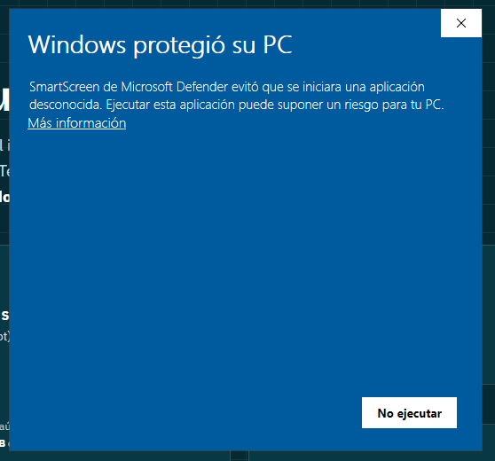
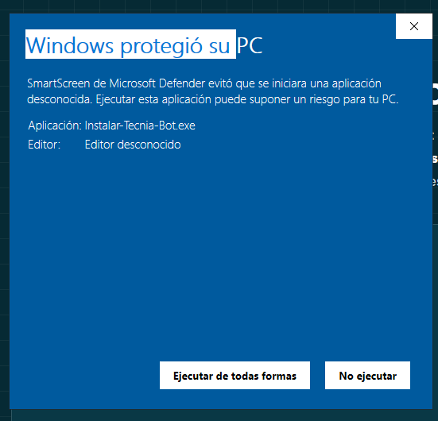
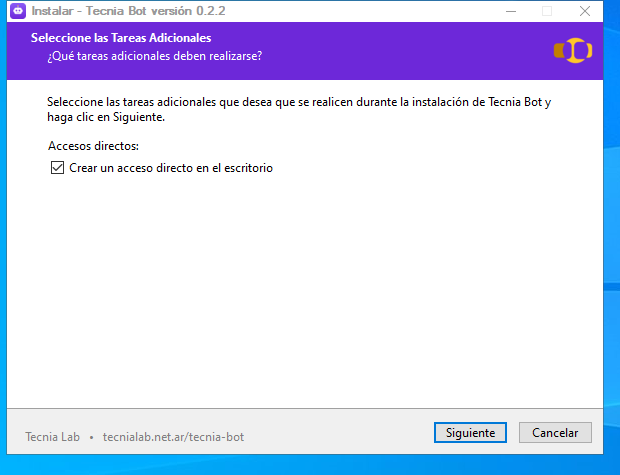

<!--
  GUÍA PARA LA WEB DE DESCARGA (tecnialab.net.ar/tecnia-bot).
  Contenido pensado para docentes. Para la IA que publica: adaptá el diseño al
  sitio, pero conservá el tono didáctico y, sobre todo, el Paso 3 (SmartScreen)
  con sus DOS capturas — es donde el docente se traba. Las imágenes están en
  ./img/ (las de SmartScreen son las reales de la primera prueba en el aula).
-->

# Cómo instalar Tecnia Bot en Windows

*Guía paso a paso para docentes — unos 5 minutos, sin saber de programación.*

## En 30 segundos

Tecnia Bot se instala **como cualquier programa**: bajás un archivo, doble clic, y "Siguiente → Siguiente → Instalar". **No necesitás ser administrador** ni instalar nada antes. Hay **un solo paso que sorprende la primera vez** —una advertencia azul de Windows— y te lo explicamos abajo para que no te asustes. 💜

---

## Paso 1 — Descargá el instalador

Tocá el botón **Descargar Tecnia Bot**. Se baja el archivo **`Instalar-Tecnia-Bot.exe`** (unos 2,5 MB).

## Paso 2 — Abrilo

Doble clic en el archivo que bajaste (está en tu carpeta **Descargas**, o abajo en la barra del navegador).

## Paso 3 — "Windows protegió su PC" (tranqui, ¡es normal!)

La primera vez, Windows te muestra una **pantalla azul** que dice *"Windows protegió su PC"*. Puede asustar, pero **es esperable y no significa que el programa tenga un virus.**

> **¿Por qué aparece?** Windows muestra este aviso con **toda aplicación nueva** que todavía no tiene una **firma digital** (un certificado pago) y que "no conoce" porque la descargó poca gente. Es un *"todavía no la vi muchas veces"*, no un *"es peligrosa"*. Tecnia Bot es **software libre y de código abierto** — su código está a la vista de todos en GitHub.

Para continuar son **dos clics**:

**1)** Hacé clic en **"Más información"** (el enlace azul).
> ⚠️ Ojo: al principio **solo se ve el botón "No ejecutar"**. El botón para seguir está escondido y **aparece recién después de tocar "Más información"**. Es la parte que confunde a todos.

**2)** Ahora sí aparece el botón **"Ejecutar de todas formas"**. Hacé clic ahí.

*(Donde dice "Editor: Editor desconocido" es normal — es porque el instalador todavía no está firmado.)*

## Paso 4 — Seguí el asistente

Se abre el **instalador de Tecnia Bot**. Hacé **Siguiente → Siguiente → Instalar**. Va a instalar todo solo. Tarda unos minutos y podés ver una ventana con texto corriendo: **es normal, está trabajando.**

## Paso 5 — ¡Listo!

Al terminar, se abre esta misma web con los **primeros pasos**, y Tecnia Bot te queda en el **menú inicio** y en el **escritorio** (con el ícono del robot 🤖). Abrilo y empezá a preguntarle.

<!-- Nota para quien publica: sumá acá una captura de la pantalla final
     "¡Tecnia Bot quedó instalado!" (banner violeta) o de Tecnia Bot ya abierto. -->
> 📸 *(Captura pendiente: pantalla final "¡Tecnia Bot quedó instalado!" o el bot abierto.)*

## Un paso más: los drivers de la placa

Cuando conectes tu **Arduino** o **ESP32**, según el chip USB Windows quizás no lo reconozca al toque. Si no aparece la placa, instalá el driver:
- **Chip CH340** → [driver CH340](https://www.wch-ic.com/downloads/CH341SER_ZIP.html)
- **Chip CP2102** → [driver CP2102](https://www.silabs.com/developers/usb-to-uart-bridge-vcp-drivers)

---

## Preguntas rápidas

- **¿Necesito ser administrador?** No hace falta. *(Y si igual lo abrís "como administrador", también funciona.)*
- **¿Es seguro?** Sí. Código abierto, **sin cuentas ni claves**, y funciona **sin internet**.
- **¿La advertencia azul de Windows va a aparecer siempre?** Va a desaparecer cuando el instalador tenga su firma digital (está en camino). Mientras tanto, es solo esos dos clics del Paso 3.
