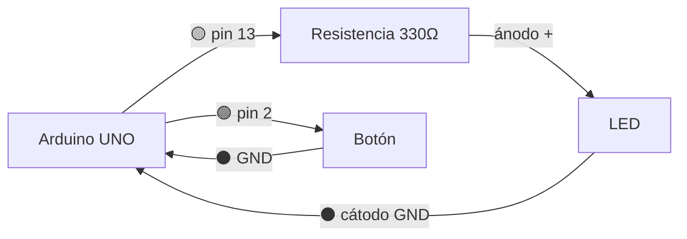

# Diagramas de conexión — cómo cablear sin equivocarse

Este skill le enseña a Tecnia Bot a documentar las conexiones de un circuito de forma clara y visual, usando **solo texto**. No necesita instalar nada.

El 80% de los errores de los alumnos son de **cableado**, no de código (polaridad del LED, GND sin conectar, 5V donde va 3.3V). Un buen diagrama de conexión evita esos errores ANTES de que pasen.

## Regla de oro: elegí el formato según DÓNDE se va a leer

| Formato | Cuándo usarlo |
|---------|---------------|
| **Dibujo ASCII** | SIEMPRE en el chat/terminal. Es lo que el alumno ve al instante, sin abrir nada. |
| **Tabla de colores de cable** | SIEMPRE, junto al dibujo. Se entiende hasta impresa en papel. |
| **Diagrama Mermaid** | SOLO cuando generás un archivo `.md` (guía, TP). Se renderiza en GitHub/VS Code, NO en la terminal. |

Para una respuesta normal en el chat: **dibujo ASCII + tabla de colores**. El Mermaid agregalo únicamente si estás escribiendo un archivo que se va a leer en GitHub o VS Code.

## Convención de colores de cable (estándar de la industria) — SIEMPRE

Usá SIEMPRE estos colores, tanto en el dibujo ASCII (nombrándolos) como en la tabla. El alumno aprende la convención real mientras arma:

| Color del cable | Para qué |
|-----------------|----------|
| 🔴 Rojo | Positivo: 5V, 3.3V, VCC |
| ⚫ Negro | Tierra: GND |
| 🟡 Amarillo / 🟢 Verde / 🔵 Azul | Señales y datos (pines digitales/analógicos) |
| 🟠 Naranja | PWM o señales especiales |

> Regla: rojo y negro NUNCA para señales. Se reservan para alimentación. Esto le salva la vida al alumno cuando el circuito crece.

## Formato 1: Dibujo ASCII (para el chat/terminal)

Dibujá el circuito con cajas y líneas. Marcá en cada cable su color y el pin. Indicá ánodo/cátodo, resistencias y notas al pie.

Ejemplo (LED + botón en Arduino UNO):

```
   Arduino UNO                    LED
  ┌───────────┐
  │      pin13├──🟡──[330Ω]──►|── ánodo (pata larga)
  │           │                │
  │       GND ├──⚫────────────┘  cátodo (pata corta)
  │           │
  │      pin 2├──🟢──┐
  │           │      │  Botón
  │       GND ├──⚫─[ /]── (al presionar, conecta pin2 a GND)
  └───────────┘
```

Reglas del dibujo ASCII:
- Poné el micro (Arduino/ESP32) como una caja a la izquierda con sus pines.
- En cada cable, escribí el emoji del color (🔴⚫🟡🟢) para reforzar la convención.
- Marcá siempre ánodo (pata larga) y cátodo (pata corta) en los LED.
- Mostrá la resistencia en el lugar real (entre el pin y el LED).
- Agregá notas al pie para explicar comportamientos ("al presionar...").

## Formato 2: Tabla de conexiones con colores (SIEMPRE, junto al dibujo)

```markdown
### Conexiones

| Desde (componente)       | Pin | Cable        | Hacia    | Pin              |
|--------------------------|-----|--------------|----------|------------------|
| LED ánodo (pata larga)   | +   | 🟡 amarillo  | Arduino  | pin 13 (con 330Ω)|
| LED cátodo (pata corta)  | -   | ⚫ negro     | Arduino  | GND              |
| Botón terminal 1         |     | 🟢 verde     | Arduino  | pin 2            |
| Botón terminal 2         |     | ⚫ negro     | Arduino  | GND              |
```

## Formato 3: Diagrama Mermaid (SOLO para archivos .md)

Usalo únicamente cuando escribís un archivo que se va a leer en GitHub o VS Code (una guía, un TP). En la terminal NO se renderiza, así que ahí va el ASCII.



Reglas del Mermaid:
- `flowchart LR` (izquierda a derecha).
- Cada componente es un nodo con nombre claro entre corchetes.
- Cada flecha lleva el color del cable y el pin en la etiqueta `-->|...|`.
- Para ESP32, usá `ESP[ESP32]` y aclarná el voltaje 3.3V en las etiquetas.

## Advertencias que SIEMPRE hay que incluir

Cuando el circuito lo amerite, agregá una nota de seguridad:

- **LED:** siempre con resistencia (220Ω–330Ω) en serie, o se quema. Respetar polaridad (pata larga = positivo).
- **ESP32:** trabaja a **3.3V**, no 5V. Conectar componentes de 5V a sus pines puede dañarlo. Usá una resistencia de 330Ω para LEDs (no 220Ω).
- **Sensores de 5V en ESP32:** usar divisor de tensión o módulo adaptador.
- **Relay / 220V:** advertir SIEMPRE sobre el peligro de la tensión de red.

## Resumen del flujo

1. En el chat → **dibujo ASCII + tabla de colores** + advertencias.
2. En un archivo .md (guía/TP) → agregá también el **Mermaid**.
3. SIEMPRE los colores de cable (🔴 positivo, ⚫ GND, colores = señal): el alumno aprende el estándar real.

## Por qué así y no con un simulador o una imagen

- Todo es **texto** → viaja dentro de la respuesta de Tecnia Bot, sin instalar nada.
- El ASCII se ve en la terminal; el Mermaid en GitHub/VS Code; la tabla en todos lados.
- El alumno aprende a **cablear** (donde más se equivoca), no solo a simular.
