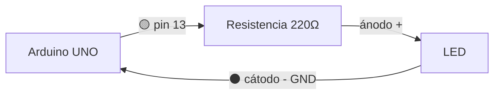
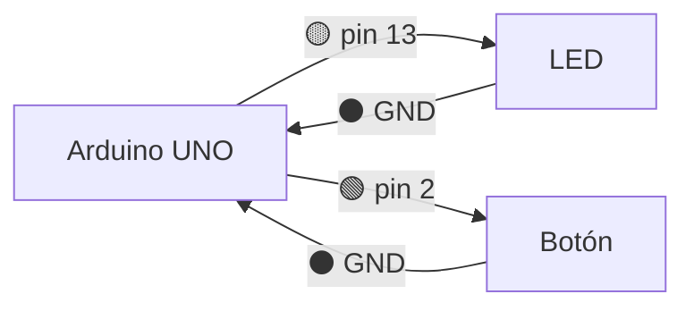

# Diagramas de conexión — cómo cablear sin equivocarse

Este skill le enseña a Profe Bot a documentar las conexiones de un circuito de forma clara y visual, usando **solo texto** (tabla + diagrama Mermaid). No necesita instalar nada: se ve en cualquier editor, en GitHub y en la web.

El 80% de los errores de los alumnos son de **cableado**, no de código (polaridad del LED, GND sin conectar, 5V donde va 3.3V). Un buen diagrama de conexión evita esos errores ANTES de que pasen.

## Regla de oro: SIEMPRE documentar las conexiones

Cada vez que des un circuito con más de un componente, mostrá las conexiones en DOS formas:
1. Una **tabla de conexiones con colores de cable**
2. Un **diagrama Mermaid**

## Convención de colores de cable (estándar de la industria)

Usá SIEMPRE estos colores. El alumno aprende la convención real mientras arma:

| Color del cable | Para qué |
|-----------------|----------|
| 🔴 Rojo | Positivo: 5V, 3.3V, VCC |
| ⚫ Negro | Tierra: GND |
| 🟡 Amarillo / 🟢 Verde / 🔵 Azul | Señales y datos (pines digitales/analógicos) |
| 🟠 Naranja | PWM o señales especiales |

> Regla: rojo y negro NUNCA para señales. Se reservan para alimentación. Esto le salva la vida al alumno cuando el circuito crece.

## Formato de la tabla de conexiones

```markdown
### Conexiones

| Desde (componente) | Pin | Cable | Hacia (Arduino) | Pin |
|--------------------|-----|-------|-----------------|-----|
| LED (ánodo, pata larga) | + | 🟡 amarillo | Arduino | pin 13 (con resistencia 220Ω) |
| LED (cátodo, pata corta) | - | ⚫ negro | Arduino | GND |
```

## Formato del diagrama Mermaid

Usá un grafo `flowchart LR` (izquierda a derecha). Cada cable es una flecha etiquetada con su color y el pin:



Reglas para el Mermaid:
- `flowchart LR` para que se lea de izquierda a derecha
- Cada componente es un nodo con nombre claro entre corchetes
- Cada flecha lleva el color del cable y el dato del pin en la etiqueta `-->|...|`
- Para ESP32, poné el nodo como `ESP[ESP32]` y recordá el voltaje en las etiquetas

## Ejemplo completo (LED con botón en Arduino UNO)

### Conexiones

| Desde | Pin | Cable | Hacia | Pin |
|-------|-----|-------|-------|-----|
| LED ánodo (pata larga) | + | 🟡 amarillo | Arduino | pin 13 |
| LED cátodo (pata corta) | - | ⚫ negro | Arduino | GND |
| Botón | terminal 1 | 🟢 verde | Arduino | pin 2 |
| Botón | terminal 2 | ⚫ negro | Arduino | GND |

### Diagrama



## Advertencias que SIEMPRE hay que incluir

Cuando el circuito lo amerite, agregá una nota de seguridad:

- **LED:** siempre con resistencia (220Ω–330Ω) en serie, o se quema. Respetar polaridad (pata larga = positivo).
- **ESP32:** trabaja a **3.3V**, no 5V. Conectar componentes de 5V a sus pines puede dañarlo.
- **Sensores de 5V en ESP32:** usar divisor de tensión o módulo adaptador.
- **Relay / 220V:** advertir SIEMPRE sobre el peligro de la tensión de red.

## Por qué así y no con un simulador o una imagen

- El diagrama es **texto** → viaja dentro de la respuesta de Profe Bot, sin instalar nada.
- Mermaid se renderiza solo en GitHub, VS Code y la web.
- La tabla de colores funciona hasta impresa en papel.
- El alumno aprende a **cablear** (que es donde más se equivoca), no solo a simular.
